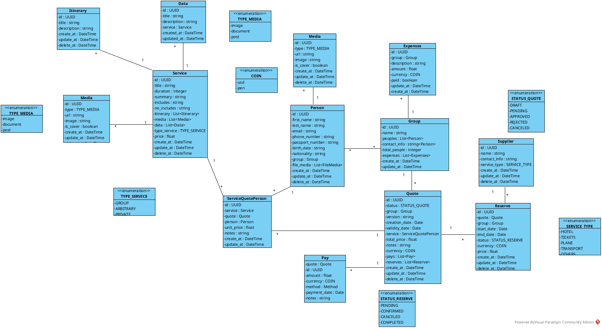

# ECO TOUR
Eco tour es un sistema diseñado para poder gestionar lo siguiente:
- Servicios turísticos
- Reservas de servicios turísticos
- Precios de servicios turísticos
- Un CRM Básico
- Usuarios del sistema
- Roles y permisos
- Reportes
- Un Todo List para la gestión de tareas
- Grupos de usuarios para la gestión en las cotizaciones

## Diagrama de Clases
Para el desarrollo del sistema se ha diseñado el siguiente diagrama de clases:

## Modulo de Servicios
- El sistema debe poder crear un servicio turístico
- El sistema debe poder agrupar diferentes servicios para la creación de un paquete
- El sistema debe poder asignar precio a un servicio turístico
- El sistema debe poder gestionar diferentes itinerarios para cada servicio turístico
- El sistema debe poder gestionar diferentes medios (imágenes, videos) para cada servicio turístico
- El sistema debe poder gestionar diferentes datos adicionales para cada servicio turístico
- Hay 3 tipos de servicios turísticos:
  - `private`
  - `group`
  - `arbitrary`

## Modulo de Reservas
